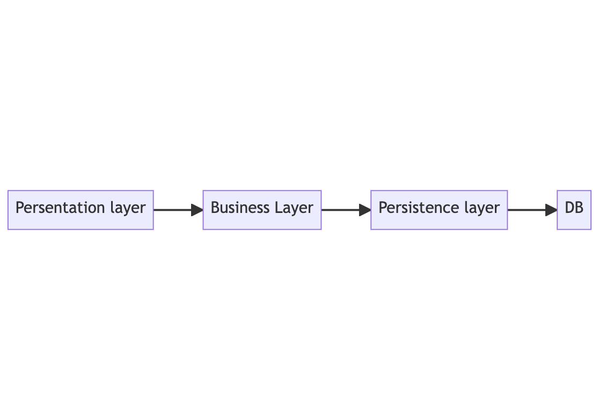

#  CRUD
CRUD is a simple application for learn FastAPI

## pre-requirements

- python 3.10.7
- poetry

## How to setup?
This project need poetry to run.
1. `poetry install`
2. `poetry shell`
3. run `pre-commit install` install to set up the git hook scripts

## How to run?
Run the server with:

`uvicorn CRUD.main:app --reload`

## project structure

<pre>
.
├── README.md
├── app
│   ├── init.py
│   ├── api
│   │   ├── init.py
│   │   ├── main.py
│   │   └── sql_app.db
│   ├── crud
│   │   ├── init.py
│   │   ├── articles.py
│   │   ├── comments.py
│   │   └── users.py
│   ├── db
│   │   ├── init.py
│   │   ├── base_class.py
│   │   └── session.py
│   ├── models
│   │   ├── init.py
│   │   ├── articles.py
│   │   ├── base.py
│   │   ├── comments.py
│   │   └── users.py
│   └── schemas
│       ├── init.py
│       ├── articles.py
│       ├── comments.py
│       └── users.py
├── poetry.lock
└── pyproject.toml
</pre>

## DB ERD

## Layered Architecture

