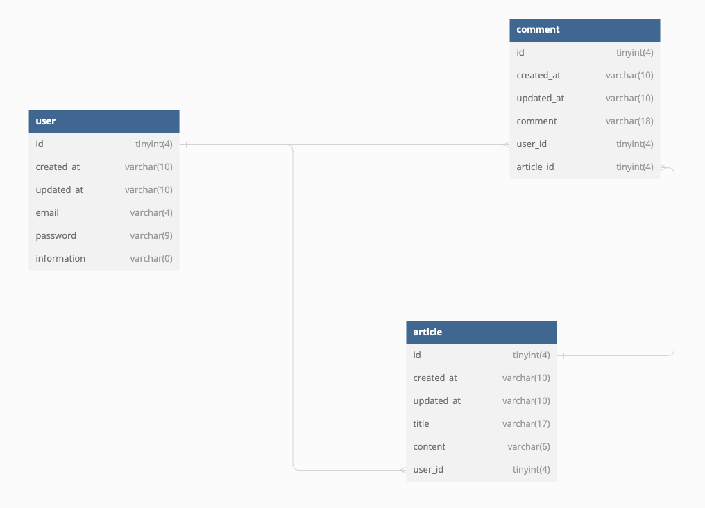

#  Goal
- **understanding of FastAPI**

## 사용 기술

- [FastAPI](https://github.com/tiangolo/fastapi)
- python 3.10.7

### tools

- [black](https://github.com/psf/black)
- [isort](https://github.com/PyCQA/isort)
- [pycln](https://github.com/hadialqattan/pycln)

## directory

<pre>
.
├── README.md
├── app
│   ├── init.py
│   ├── api
│   │   ├── init.py
│   │   ├── main.py
│   │   └── sql_app.db
│   ├── crud
│   │   ├── init.py
│   │   ├── articles.py
│   │   ├── comments.py
│   │   └── users.py
│   ├── db
│   │   ├── init.py
│   │   ├── base_class.py
│   │   └── session.py
│   ├── models
│   │   ├── init.py
│   │   ├── articles.py
│   │   ├── base.py
│   │   ├── comments.py
│   │   └── users.py
│   └── schemas
│       ├── init.py
│       ├── articles.py
│       ├── comments.py
│       └── users.py
├── poetry.lock
└── pyproject.toml
</pre>

## DB ERD

