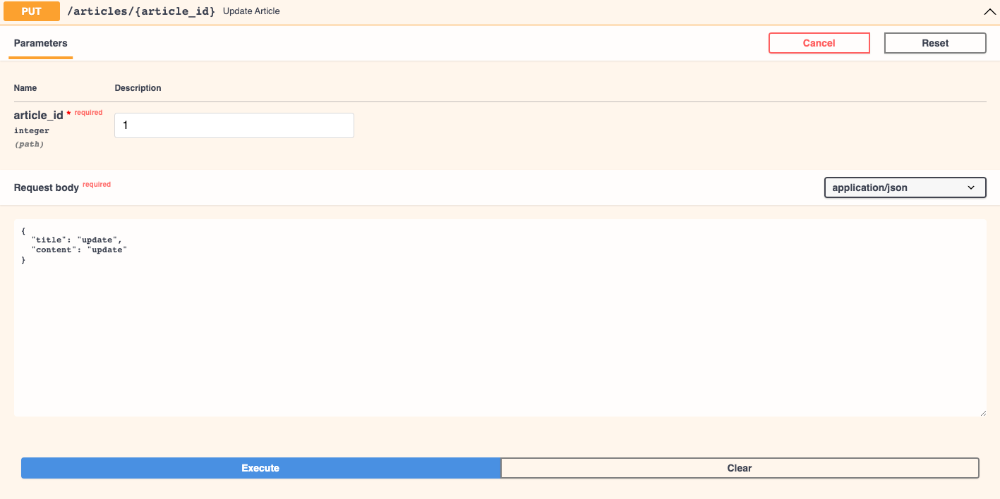
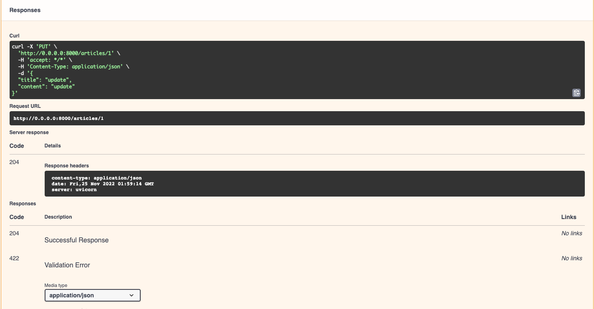
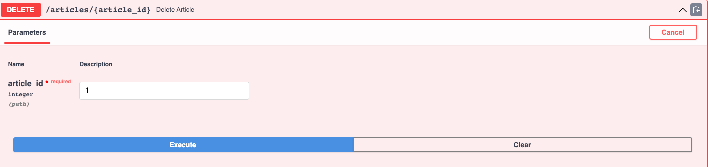
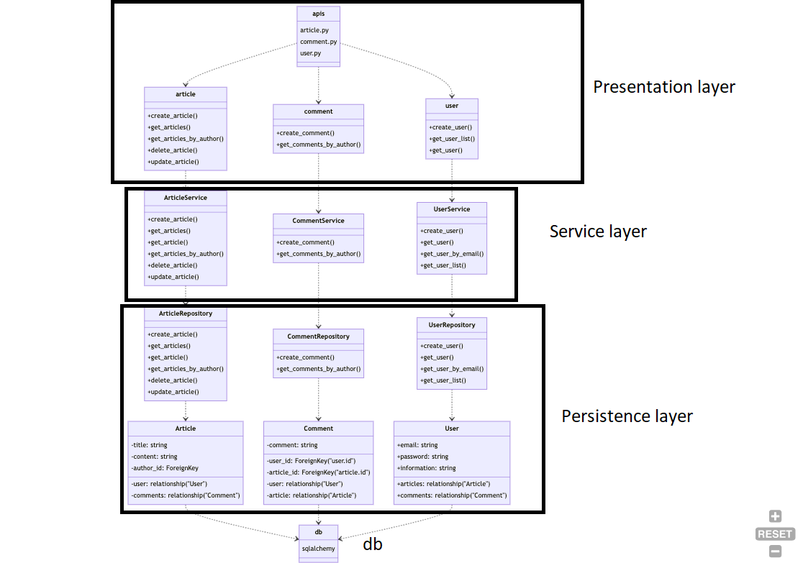

#  CRUD
CRUD is a simple application for learn FastAPI

## Pre-requirements

- python >= 3.10.8
- poetry 1.2.2

## How to setup?
This project need poetry to run.
1. `poetry install`
2. `poetry shell`
3. run `pre-commit install` install to set up the git hook scripts

## How to run?
Run the server with:

`make run`

## What you can do?
http://0.0.0.0:8000/ (this is open api for test our application, you can execute api here)

1. create user http://0.0.0.0:8000/docs#/users/create_user_users__post
2. create article http://0.0.0.0:8000/docs#/articles/create_article_articles__user_id__post
3. create comment http://0.0.0.0:8000/docs#/comments/create_comment_comments__post
4. It also supports retrieve.

### User scenario
1. Create user
2. Can get user list
3. Can get user by user_id
4. Create article
5. Can update article
6. Can delete article
7. Can get articles
8. Can get articles by author_id
9. Create comment
10. Can get comments by author_id

### Create user

### Create article

### Create comment

### Update article

### Delete article

## Project structure

<pre>
.
├── CHANGELOG.md
├── Makefile
├── README.md
├── crud
│   ├── __init__.py
│   ├── apis
│   │   ├── __init__.py
│   │   ├── request
│   │   │   ├── article.py
│   │   │   ├── comment.py
│   │   │   └── user.py
│   │   ├── response
│   │   │   ├── article.py
│   │   │   ├── comment.py
│   │   │   └── user.py
│   │   └── v1
│   │       ├── __init__.py
│   │       ├── api.py
│   │       └── endpoints
│   │           ├── __init__.py
│   │           ├── article.py
│   │           ├── comment.py
│   │           └── user.py
│   ├── db
│   │   ├── __init__.py
│   │   ├── base.py
│   │   ├── base_class.py
│   │   ├── init_db.py
│   │   ├── model
│   │   │   ├── __init__.py
│   │   │   ├── article.py
│   │   │   ├── comment.py
│   │   │   └── user.py
│   │   └── session.py
│   ├── main.py
│   ├── repository
│   │   ├── __init__.py
│   │   ├── article.py
│   │   ├── comment.py
│   │   └── user.py
│   ├── schema
│   │   ├── __init__.py
│   │   ├── article.py
│   │   ├── comment.py
│   │   └── user.py
│   └── service
│       ├── __init__.py
│       ├── article.py
│       ├── comment.py
│       └── user.py
├── poetry.lock
├── pyproject.toml
└── tests
    ├── __init__.py
    ├── conftest.py
    └── test_apis
        ├── __init__.py
        ├── test_articles.py
        ├── test_comments.py
        ├── test_users.py
        └── test_users_unit.py
</pre>

## DB ERD

## Class diagram

